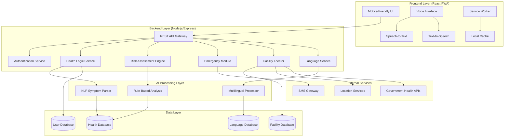
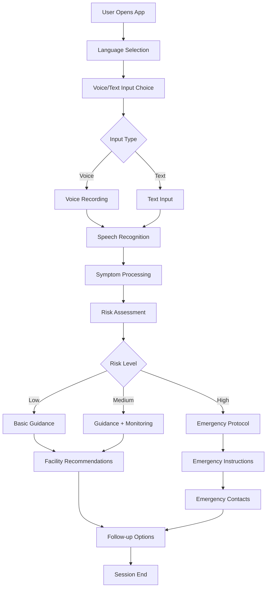
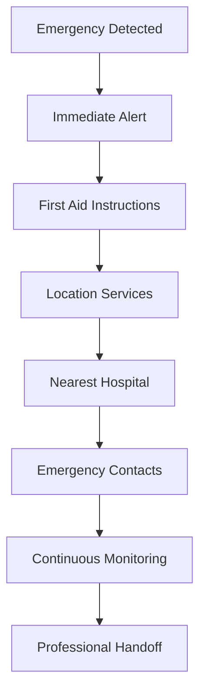
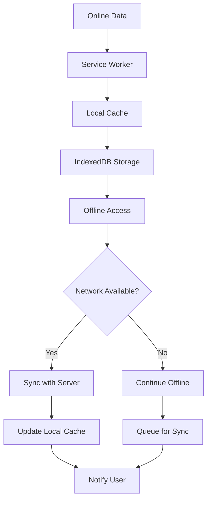
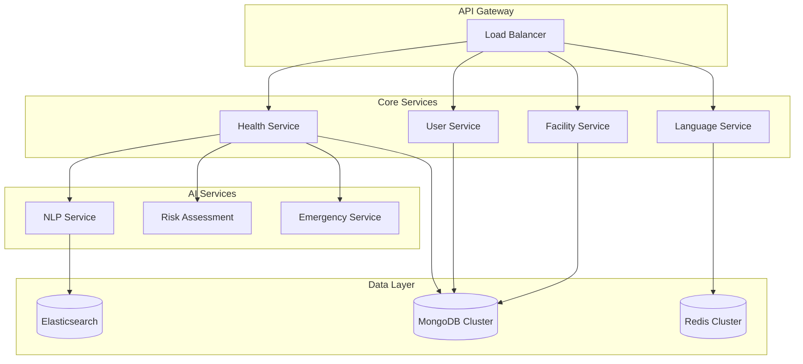

# Design Document: Swasthya Voice-Enabled Health Assistant

## System Overview

Swasthya is a web-based, mobile-friendly voice-enabled health assistant specifically designed for rural India. The system provides advisory-only healthcare guidance through a React frontend with Node.js backend, emphasizing voice-first interaction in multiple Indian languages. The architecture prioritizes accessibility, safety, and reliability while clearly stating that it does not replace medical professionals and follows ethical AI principles.

The system employs a progressive web app (PWA) approach for mobile compatibility, with offline-first capabilities for essential health information. Core functionality includes voice/text symptom input, NLP-based symptom understanding, rule-based risk analysis, basic health suggestions, maternal and child care information, emergency first-aid guidance, and location-based government healthcare facility recommendations.

**Critical Disclaimer**: Swasthya provides advisory guidance only and does not replace medical professionals. All recommendations emphasize seeking professional medical care when appropriate, following strict ethical AI principles for healthcare applications.

## High-Level Architecture



### Technology Stack

**Frontend (React PWA)**:
- React 18+ with TypeScript for type safety
- Progressive Web App with offline capabilities
- Web Speech API for speech recognition
- Web Speech Synthesis API for text-to-speech
- Service Worker for caching and offline functionality
- Responsive design for mobile-first experience

**Backend (Node.js/Express)**:
- Node.js 18+ with Express.js framework
- TypeScript for enhanced development experience
- JWT-based authentication for user sessions
- RESTful API design with OpenAPI documentation
- Rate limiting and security middleware

**AI Processing Layer**:
- Natural Language Processing using compromise.js for symptom parsing
- Rule-based decision trees for risk assessment
- Multilingual support using i18next
- Custom symptom matching algorithms

**Data Storage**:
- MongoDB for flexible health data storage
- Redis for session management and caching
- Local Storage/IndexedDB for offline data
- Encrypted data transmission and storage

## Component Breakdown

### Frontend Components (React)

**VoiceInterface Component**
```typescript
interface VoiceInterfaceProps {
  onSpeechResult: (text: string, language: string) => void;
  onSpeechError: (error: SpeechError) => void;
  supportedLanguages: string[];
}
```
- Manages Web Speech API integration
- Handles speech recognition and synthesis
- Provides voice command interpretation
- Implements retry logic for failed recognition

**HealthQueryInterface Component**
```typescript
interface HealthQueryProps {
  onQuerySubmit: (query: HealthQuery) => void;
  isLoading: boolean;
  supportedLanguages: string[];
}
```
- Dual input mode (voice and text)
- Real-time symptom suggestion
- Language selection interface
- Query history and context management

**HealthResponseDisplay Component**
```typescript
interface HealthResponseProps {
  response: HealthResponse;
  onEmergencyAction: () => void;
  onFacilitySearch: () => void;
}
```
- Displays health guidance with clear disclaimers
- Emergency action buttons
- Facility search integration
- Audio playback for responses

**EmergencyModule Component**
```typescript
interface EmergencyProps {
  emergencyType: EmergencyType;
  userLocation?: Location;
  onCallEmergency: () => void;
}
```
- Step-by-step first-aid instructions
- Emergency contact integration
- Location-based emergency services
- Critical action prioritization

### Backend Services (Node.js/Express)

**Health Logic Service**
```typescript
class HealthLogicService {
  async processHealthQuery(query: HealthQuery): Promise<HealthResponse>
  async getBasicGuidance(symptoms: Symptom[]): Promise<Guidance>
  async enforceDisclaimer(): Promise<DisclaimerText>
  async checkEmergencyStatus(query: HealthQuery): Promise<EmergencyLevel>
}
```

**Risk Assessment Engine**
```typescript
class RiskAssessmentEngine {
  async assessRisk(symptoms: Symptom[], profile: UserProfile): Promise<RiskScore>
  async identifyWarningSignals(symptoms: Symptom[]): Promise<WarningSign[]>
  async recommendAction(riskScore: RiskScore): Promise<ActionRecommendation>
}
```

**Language Service**
```typescript
class LanguageService {
  async translateText(text: string, targetLanguage: string): Promise<string>
  async detectLanguage(text: string): Promise<string>
  async getLocalizedContent(key: string, language: string): Promise<string>
}
```

**Facility Locator Service**
```typescript
class FacilityLocatorService {
  async findNearbyFacilities(location: Location): Promise<Facility[]>
  async getGovernmentSchemes(profile: UserProfile): Promise<Scheme[]>
  async getFacilityDetails(facilityId: string): Promise<FacilityDetails>
}
```

### AI Processing Components

**NLP Symptom Parser**
```typescript
class NLPSymptomParser {
  async parseSymptoms(text: string, language: string): Promise<Symptom[]>
  async extractMedicalEntities(text: string): Promise<MedicalEntity[]>
  async classifyIntent(text: string): Promise<QueryIntent>
}
```

**Rule-Based Analysis Engine**
```typescript
class RuleBasedAnalysis {
  async evaluateRiskRules(symptoms: Symptom[]): Promise<RiskEvaluation>
  async applyEmergencyRules(symptoms: Symptom[]): Promise<EmergencyStatus>
  async generateRecommendations(analysis: RiskEvaluation): Promise<Recommendation[]>
}
```

## Frontend-Backend Interaction

### API Endpoints

**Health Query Processing**
```
POST /api/health/query
Content-Type: application/json
Authorization: Bearer <jwt-token>

Request:
{
  "query": "मुझे बुखार और सिरदर्द है",
  "language": "hi-IN",
  "userProfile": {
    "age": 35,
    "gender": "female",
    "location": { "lat": 28.6139, "lng": 77.2090 }
  }
}

Response:
{
  "guidance": "बुखार और सिरदर्द के लिए...",
  "riskLevel": "moderate",
  "recommendations": [...],
  "disclaimer": "यह सलाह केवल जानकारी के लिए है...",
  "requiresMedicalAttention": true
}
```

**Emergency Processing**
```
POST /api/emergency/assess
Content-Type: application/json

Request:
{
  "symptoms": ["chest_pain", "difficulty_breathing"],
  "severity": "high",
  "location": { "lat": 28.6139, "lng": 77.2090 }
}

Response:
{
  "isEmergency": true,
  "firstAidInstructions": [...],
  "nearestHospital": {...},
  "emergencyContacts": [...]
}
```

**Facility Search**
```
GET /api/facilities/nearby?lat=28.6139&lng=77.2090&radius=10
Authorization: Bearer <jwt-token>

Response:
{
  "facilities": [
    {
      "id": "phc_001",
      "name": "Primary Health Center - Sector 15",
      "type": "PHC",
      "distance": 2.5,
      "services": ["general_medicine", "maternal_care"],
      "contact": "+91-11-12345678"
    }
  ]
}
```

### Real-time Communication

**WebSocket Integration for Emergency Situations**
```typescript
// Frontend WebSocket connection
const emergencySocket = new WebSocket('wss://api.swasthya.in/emergency');

emergencySocket.onmessage = (event) => {
  const emergencyUpdate = JSON.parse(event.data);
  if (emergencyUpdate.type === 'CRITICAL_ALERT') {
    displayEmergencyAlert(emergencyUpdate);
  }
};
```

## AI Processing Flow

### Symptom Understanding Pipeline

```mermaid
graph LR
    A[User Input] --> B[Language Detection]
    B --> C[Speech-to-Text]
    C --> D[NLP Processing]
    D --> E[Symptom Extraction]
    E --> F[Medical Entity Recognition]
    F --> G[Intent Classification]
    G --> H[Risk Assessment]
    H --> I[Response Generation]
    I --> J[Text-to-Speech]
    J --> K[User Response]
```



### NLP Processing Details

**Symptom Extraction Algorithm**
```typescript
class SymptomExtractor {
  async extractSymptoms(text: string, language: string): Promise<Symptom[]> {
    // 1. Tokenization and normalization
    const tokens = this.tokenize(text, language);
    
    // 2. Medical entity recognition
    const entities = await this.recognizeMedicalEntities(tokens);
    
    // 3. Symptom mapping
    const symptoms = this.mapToSymptoms(entities, language);
    
    // 4. Severity assessment
    return this.assessSeverity(symptoms, text);
  }
}
```

**Rule-Based Risk Analysis**
```typescript
class RiskAnalyzer {
  async analyzeRisk(symptoms: Symptom[]): Promise<RiskAssessment> {
    const riskRules = await this.loadRiskRules();
    let totalRisk = 0;
    const triggeredRules = [];
    
    for (const rule of riskRules) {
      if (this.evaluateRule(rule, symptoms)) {
        totalRisk += rule.weight;
        triggeredRules.push(rule);
      }
    }
    
    return {
      riskScore: totalRisk,
      riskLevel: this.categorizeRisk(totalRisk),
      triggeredRules,
      recommendations: this.generateRecommendations(triggeredRules)
    };
  }
}
```

## User Flow

### Primary User Journey



### Emergency Flow



## Data Flow

### Health Query Data Flow


### Offline Data Synchronization



## Data Models

### Core Data Models (TypeScript)

```typescript
interface HealthQuery {
  id: string;
  userId: string;
  queryText: string;
  language: string;
  intent: QueryIntent;
  symptoms: Symptom[];
  timestamp: Date;
  location?: Location;
}

interface Symptom {
  name: string;
  severity: SeverityLevel;
  duration: string;
  bodyPart: string;
  description: string;
  confidence: number;
}

interface HealthResponse {
  queryId: string;
  guidance: string;
  riskLevel: RiskLevel;
  recommendations: Recommendation[];
  disclaimer: string;
  requiresMedicalAttention: boolean;
  followUpRequired: boolean;
}

interface UserProfile {
  userId: string;
  age: number;
  gender: Gender;
  location: Location;
  preferredLanguage: string;
  healthHistory: HealthRecord[];
  isPregnant?: boolean;
  children: ChildProfile[];
  emergencyContacts: EmergencyContact[];
}

interface Facility {
  id: string;
  name: string;
  type: FacilityType;
  location: Location;
  contactInfo: ContactInfo;
  services: Service[];
  operatingHours: OperatingHours;
  governmentSchemes: string[];
  rating: number;
  distance?: number;
}
```

### Database Schema (MongoDB)

**Health Information Collection:**
```javascript
{
  _id: ObjectId,
  condition: String,
  symptoms: [String],
  riskLevel: String,
  guidance: {
    hindi: String,
    english: String,
    tamil: String,
    // ... other languages
  },
  recommendations: [String],
  emergencyIndicators: [String],
  createdAt: Date,
  updatedAt: Date
}
```

**User Data Collection:**
```javascript
{
  _id: ObjectId,
  userId: String,
  profile: {
    age: Number,
    gender: String,
    location: {
      type: "Point",
      coordinates: [Number, Number]
    },
    preferredLanguage: String
  },
  healthHistory: [{
    date: Date,
    symptoms: [String],
    diagnosis: String,
    treatment: String
  }],
  preferences: {
    voiceEnabled: Boolean,
    emergencyContacts: [String]
  },
  createdAt: Date,
  lastActive: Date
}
```

**Facility Data Collection:**
```javascript
{
  _id: ObjectId,
  facilityId: String,
  name: String,
  type: String, // PHC, CHC, District Hospital
  location: {
    type: "Point",
    coordinates: [Number, Number]
  },
  contact: {
    phone: String,
    email: String,
    address: String
  },
  services: [String],
  operatingHours: {
    weekdays: String,
    weekends: String,
    emergency: Boolean
  },
  governmentSchemes: [String],
  lastUpdated: Date
}
```

## Security and Privacy Considerations

### Data Protection Framework

**Encryption Standards:**
- TLS 1.3 for all data transmission
- AES-256 encryption for sensitive data at rest
- JWT tokens with RS256 signing for authentication
- End-to-end encryption for voice data transmission

**Privacy by Design:**
```typescript
class PrivacyManager {
  async anonymizeHealthData(data: HealthQuery): Promise<AnonymizedData> {
    return {
      ...data,
      userId: this.hashUserId(data.userId),
      location: this.fuzzyLocation(data.location),
      personalIdentifiers: undefined
    };
  }
  
  async enforceDataRetention(userId: string): Promise<void> {
    // Automatic data deletion after 2 years
    // User-initiated deletion anytime
    // Anonymization of historical data
  }
}
```

**Access Control:**
- Role-based access control (RBAC)
- API rate limiting per user
- Audit logging for all health data access
- Multi-factor authentication for admin access

### Ethical AI Implementation

**Bias Prevention:**
```typescript
class EthicalAIGuard {
  async validateResponse(response: HealthResponse): Promise<ValidationResult> {
    // Check for gender bias in recommendations
    // Ensure cultural sensitivity in guidance
    // Validate medical accuracy
    // Confirm disclaimer presence
    return this.comprehensiveValidation(response);
  }
}
```

**Medical Disclaimer Enforcement:**
- Mandatory disclaimer on every health response
- Clear statement about advisory nature only
- Emphasis on professional medical consultation
- Regular review by medical professionals

### Compliance Framework

**Healthcare Regulations:**
- Compliance with Indian medical device regulations
- Adherence to Digital Information Security in Healthcare Act (DISHA)
- Following WHO guidelines for digital health interventions
- Regular medical content validation

**Data Protection:**
- GDPR-style privacy controls
- User consent management
- Right to data portability
- Right to be forgotten implementation

## Scalability and Future Expansion

### Horizontal Scaling Architecture

**Microservices Decomposition:**


**Performance Optimization:**
- CDN for static health content
- Database sharding by geographic regions
- Caching layers with Redis
- Elasticsearch for fast symptom search

### Future Expansion Roadmap

**Phase 1: Core Functionality (Months 1-6)**
- Basic health guidance system
- Voice interface in 3 languages
- Emergency first-aid module
- Facility locator for major cities

**Phase 2: Enhanced Features (Months 7-12)**
- Maternal and child health modules
- Integration with government health APIs
- Offline functionality enhancement
- Additional regional languages

**Phase 3: Advanced AI (Months 13-18)**
- Machine learning for personalized recommendations
- Predictive health analytics
- Integration with wearable devices
- Telemedicine consultation booking

**Phase 4: Ecosystem Integration (Months 19-24)**
- Integration with Electronic Health Records
- Partnership with healthcare providers
- Community health worker dashboard
- Health insurance integration

### Technology Evolution Path

**AI Enhancement:**
- Transition from rule-based to ML-based risk assessment
- Implementation of large language models for better NLP
- Computer vision for symptom assessment through images
- Predictive modeling for health outcomes

**Platform Expansion:**
- Native mobile apps for iOS and Android
- WhatsApp chatbot integration
- SMS-based interaction for feature phones
- Voice-only interface for accessibility

**Integration Capabilities:**
- Government health system APIs
- Electronic Health Record systems
- Pharmacy and medicine delivery services
- Health insurance claim processing

This comprehensive design ensures Swasthya can scale from a basic health advisory system to a comprehensive digital health platform while maintaining its core mission of providing safe, accessible healthcare guidance to rural India.

*A property is a characteristic or behavior that should hold true across all valid executions of a system—essentially, a formal statement about what the system should do. Properties serve as the bridge between human-readable specifications and machine-verifiable correctness guarantees.*

### Property 1: Language Consistency
*For any* supported language input, the Swasthya_System should recognize the speech and respond in the same language, maintaining language consistency throughout the interaction.
**Validates: Requirements 1.1**

### Property 2: Speech Recognition Retry Behavior
*For any* speech recognition failure, the Voice_Interface should implement exactly 3 retry attempts before escalating to alternative input methods.
**Validates: Requirements 1.3**

### Property 3: Noise Handling Consistency
*For any* background noise interference scenario, the Swasthya_System should filter noise and request clearer input while maintaining recognition functionality.
**Validates: Requirements 1.5**

### Property 4: Health Guidance Provision
*For any* common symptom query, the Health_Database should provide evidence-based guidance and recommendations without exception.
**Validates: Requirements 2.1**

### Property 5: Medical Disclaimer Enforcement
*For any* health advice provided, the Swasthya_System should display and announce medical disclaimers stating that advice is for informational purposes only and does not replace doctors.
**Validates: Requirements 2.3, 9.1, 9.2**

### Property 6: Medical Escalation for Serious Symptoms
*For any* serious symptoms or high-risk indicators, the Swasthya_System should immediately recommend seeking professional medical attention.
**Validates: Requirements 2.4, 3.2, 9.3**

### Property 7: Professional Advice for Uncertainty
*For any* uncertain or ambiguous health query, the Swasthya_System should direct users to seek professional medical advice.
**Validates: Requirements 2.5**

### Property 8: Risk Assessment Execution
*For any* symptom description provided by users, the Risk_Assessment_Engine should evaluate them against known risk patterns and provide appropriate risk scoring.
**Validates: Requirements 3.1**

### Property 9: Risk Factor Prioritization
*For any* scenario with multiple risk factors present, the Swasthya_System should prioritize the most urgent recommendations based on severity and immediacy.
**Validates: Requirements 3.4**

### Property 10: Pregnancy-Specific Guidance
*For any* user indicating pregnancy status, the Swasthya_System should offer trimester-specific advice and reminders appropriate to their pregnancy stage.
**Validates: Requirements 4.2**

### Property 11: Age-Appropriate Child Health Guidance
*For any* child health query with age information, the Swasthya_System should provide age-appropriate guidance and urgency indicators.
**Validates: Requirements 4.4**

### Property 12: Maternal and Child Health Reminders
*For any* user profile with maternal or child health needs, the Swasthya_System should generate reminders for important checkups and health milestones.
**Validates: Requirements 4.5**

### Property 13: Emergency Response with Instructions
*For any* emergency situation reported, the Emergency_Module should provide step-by-step first-aid instructions and immediately advise seeking professional emergency care.
**Validates: Requirements 5.1, 5.4**

### Property 14: Emergency Instruction Repeatability
*For any* emergency instruction sequence, the Swasthya_System should provide the option to repeat steps when requested by the user.
**Validates: Requirements 5.3**

### Property 15: Facility Location Services
*For any* facility search request with location information, the Facility_Locator should provide information about the closest healthcare centers including contact details, services, and operating hours.
**Validates: Requirements 6.1, 6.4**

### Property 16: Location-Based Distance Information
*For any* facility query with user location, the Facility_Locator should provide distance and direction information using location services.
**Validates: Requirements 6.5**

### Property 17: Network Resilience
*For any* intermittent connectivity scenario, the Swasthya_System should function properly by utilizing cached data and offline capabilities.
**Validates: Requirements 7.2**

### Property 18: Offline Caching Behavior
*For any* poor connectivity situation, the Swasthya_System should cache essential health information for offline access and provide basic functionality.
**Validates: Requirements 7.3**

### Property 19: Hardware Compatibility
*For any* basic smartphone with minimum specifications (1GB RAM, basic microphone/speakers), the Voice_Interface should work properly.
**Validates: Requirements 7.5**

### Property 20: Comprehensive Data Protection
*For any* user health data, the Swasthya_System should encrypt during transmission and storage, request explicit consent for collection, and allow user-initiated data deletion.
**Validates: Requirements 8.1, 8.2, 8.4**

### Property 21: Data Sharing Restrictions
*For any* user data, the Swasthya_System should not share with third parties without explicit user consent.
**Validates: Requirements 8.5**

### Property 22: Essential Data Storage Only
*For any* user profile, the User_Profile should store only essential information required for personalized guidance, following data minimization principles.
**Validates: Requirements 8.3**

### Property 23: Prescription Drug Restriction
*For any* health query, the Swasthya_System should never provide prescription drug recommendations or dosage information.
**Validates: Requirements 9.4**

### Property 24: Conservative Medical Approach
*For any* uncertain medical situation, the Swasthya_System should err on the side of recommending professional care rather than providing potentially risky self-care advice.
**Validates: Requirements 9.5**

### Property 25: Comprehensive Offline Functionality
*For any* offline scenario, the Swasthya_System should provide critical health information, basic first-aid instructions, emergency guidance, and essential maternal/child health information.
**Validates: Requirements 10.1, 10.2, 10.3**

### Property 26: Data Synchronization on Connectivity Restoration
*For any* connectivity restoration event, the Swasthya_System should sync user data and update cached information automatically.
**Validates: Requirements 10.4**

## Error Handling

### Voice Recognition Errors
- **Recognition Failure**: Implement 3-retry mechanism with progressively clearer instructions
- **Language Detection Errors**: Fallback to user's preferred language from profile
- **Audio Quality Issues**: Provide feedback on audio quality and suggest optimal speaking conditions
- **Timeout Handling**: Graceful timeout with option to restart interaction

### Health Query Processing Errors
- **Ambiguous Symptoms**: Request clarification while providing general safety guidance
- **Unknown Conditions**: Direct to professional medical consultation with disclaimer
- **Incomplete Information**: Ask follow-up questions while maintaining conversation flow
- **Risk Assessment Failures**: Default to conservative recommendations and medical referral

### Data and Connectivity Errors
- **Network Failures**: Seamless fallback to offline mode with cached data
- **Database Corruption**: Automatic data integrity checks and recovery procedures
- **Storage Limitations**: Intelligent cache management with priority-based retention
- **Synchronization Conflicts**: User-controlled conflict resolution with safety prioritization

### Emergency Handling Errors
- **Emergency Detection Failures**: Err on the side of treating situations as emergencies
- **Instruction Delivery Failures**: Multiple delivery methods (voice, text, visual cues)
- **Location Service Failures**: Provide general emergency guidance and manual location entry
- **Critical System Failures**: Immediate escalation to emergency services contact information

### User Experience Error Recovery
- **Language Switching Errors**: Maintain conversation context across language changes
- **Profile Corruption**: Graceful degradation with anonymous usage mode
- **Preference Loading Failures**: Use safe defaults while preserving user safety
- **Session Management Errors**: Automatic session recovery with conversation continuity

## Testing Strategy

### Dual Testing Approach

The testing strategy employs both unit testing and property-based testing to ensure comprehensive coverage and correctness validation.

**Unit Testing Focus:**
- Specific examples demonstrating correct behavior for common use cases
- Edge cases and boundary conditions (empty inputs, maximum values, invalid data)
- Integration points between components (voice interface to language processor)
- Error conditions and recovery mechanisms
- Specific medical scenarios and emergency situations

**Property-Based Testing Focus:**
- Universal properties that hold across all valid inputs
- Comprehensive input coverage through randomization
- Correctness properties validation as defined in the design document
- System behavior consistency across different languages and user profiles
- Data integrity and security properties across various scenarios

### Property-Based Testing Configuration

**Testing Framework**: Use fast-check for JavaScript/TypeScript or Hypothesis for Python implementation
**Test Iterations**: Minimum 100 iterations per property test to ensure statistical confidence
**Property Test Tagging**: Each property test must reference its design document property using the format:
```
// Feature: swasthya, Property 1: Language Consistency
```

### Core Testing Areas

**Voice Interface Testing:**
- Unit tests for specific language recognition scenarios
- Property tests for language consistency across all supported languages
- Integration tests for voice-to-response workflows
- Performance tests for recognition speed and accuracy

**Health Logic Testing:**
- Unit tests for specific symptom-to-guidance mappings
- Property tests for risk assessment consistency
- Integration tests for emergency detection and response
- Safety tests for medical disclaimer enforcement

**Data Management Testing:**
- Unit tests for specific data operations (create, read, update, delete)
- Property tests for data encryption and privacy protection
- Integration tests for offline-online synchronization
- Performance tests for cache management and retrieval

**System Integration Testing:**
- End-to-end workflow testing for complete user interactions
- Cross-component integration testing
- Offline functionality testing with network simulation
- Device compatibility testing on target hardware specifications

### Test Data Management

**Synthetic Health Data**: Generate realistic but anonymized health scenarios for testing
**Multi-language Test Data**: Comprehensive test datasets in all supported languages
**Edge Case Scenarios**: Systematic generation of boundary conditions and error states
**Performance Test Data**: Large-scale datasets for stress testing and performance validation

### Continuous Testing Requirements

**Automated Test Execution**: All tests run on every code change
**Property Test Monitoring**: Track property test failure rates and adjust thresholds
**Performance Regression Testing**: Monitor response times and resource usage
**Security Testing**: Regular validation of encryption and privacy properties
**Medical Content Validation**: Periodic review of health guidance accuracy with medical professionals

### Testing Success Criteria

**Unit Test Coverage**: Minimum 90% code coverage for critical health and safety components
**Property Test Success**: All correctness properties must pass 100% of iterations
**Integration Test Reliability**: End-to-end tests must pass consistently across target devices
**Performance Benchmarks**: Voice recognition under 3 seconds, app startup under 10 seconds
**Security Validation**: All data protection properties must pass without exception
## Correctness Properties

*A property is a characteristic or behavior that should hold true across all valid executions of a system—essentially, a formal statement about what the system should do. Properties serve as the bridge between human-readable specifications and machine-verifiable correctness guarantees.*

### Property 1: Language Consistency
*For any* supported language input, the Swasthya_System should recognize the speech and respond in the same language, maintaining language consistency throughout the interaction.
**Validates: Requirements 1.1**

### Property 2: Speech Recognition Retry Behavior
*For any* speech recognition failure, the Voice_Interface should implement exactly 3 retry attempts before escalating to alternative input methods.
**Validates: Requirements 1.3**

### Property 3: Noise Handling Consistency
*For any* background noise interference scenario, the Swasthya_System should filter noise and request clearer input while maintaining recognition functionality.
**Validates: Requirements 1.5**

### Property 4: Health Guidance Provision
*For any* common symptom query, the Health_Database should provide evidence-based guidance and recommendations without exception.
**Validates: Requirements 2.1**

### Property 5: Medical Disclaimer Enforcement
*For any* health advice provided, the Swasthya_System should display and announce medical disclaimers stating that advice is for informational purposes only and does not replace doctors.
**Validates: Requirements 2.3, 9.1, 9.2**

### Property 6: Medical Escalation for Serious Symptoms
*For any* serious symptoms or high-risk indicators, the Swasthya_System should immediately recommend seeking professional medical attention.
**Validates: Requirements 2.4, 3.2, 9.3**

### Property 7: Professional Advice for Uncertainty
*For any* uncertain or ambiguous health query, the Swasthya_System should direct users to seek professional medical advice.
**Validates: Requirements 2.5**

### Property 8: Risk Assessment Execution
*For any* symptom description provided by users, the Risk_Assessment_Engine should evaluate them against known risk patterns and provide appropriate risk scoring.
**Validates: Requirements 3.1**

### Property 9: Risk Factor Prioritization
*For any* scenario with multiple risk factors present, the Swasthya_System should prioritize the most urgent recommendations based on severity and immediacy.
**Validates: Requirements 3.4**

### Property 10: Pregnancy-Specific Guidance
*For any* user indicating pregnancy status, the Swasthya_System should offer trimester-specific advice and reminders appropriate to their pregnancy stage.
**Validates: Requirements 4.2**

### Property 11: Age-Appropriate Child Health Guidance
*For any* child health query with age information, the Swasthya_System should provide age-appropriate guidance and urgency indicators.
**Validates: Requirements 4.4**

### Property 12: Maternal and Child Health Reminders
*For any* user profile with maternal or child health needs, the Swasthya_System should generate reminders for important checkups and health milestones.
**Validates: Requirements 4.5**

### Property 13: Emergency Response with Instructions
*For any* emergency situation reported, the Emergency_Module should provide step-by-step first-aid instructions and immediately advise seeking professional emergency care.
**Validates: Requirements 5.1, 5.4**

### Property 14: Emergency Instruction Repeatability
*For any* emergency instruction sequence, the Swasthya_System should provide the option to repeat steps when requested by the user.
**Validates: Requirements 5.3**

### Property 15: Facility Location Services
*For any* facility search request with location information, the Facility_Locator should provide information about the closest healthcare centers including contact details, services, and operating hours.
**Validates: Requirements 6.1, 6.4**

### Property 16: Location-Based Distance Information
*For any* facility query with user location, the Facility_Locator should provide distance and direction information using location services.
**Validates: Requirements 6.5**

### Property 17: Network Resilience
*For any* intermittent connectivity scenario, the Swasthya_System should function properly by utilizing cached data and offline capabilities.
**Validates: Requirements 7.2**

### Property 18: Offline Caching Behavior
*For any* poor connectivity situation, the Swasthya_System should cache essential health information for offline access and provide basic functionality.
**Validates: Requirements 7.3**

### Property 19: Hardware Compatibility
*For any* basic smartphone with minimum specifications (1GB RAM, basic microphone/speakers), the Voice_Interface should work properly.
**Validates: Requirements 7.5**

### Property 20: Comprehensive Data Protection
*For any* user health data, the Swasthya_System should encrypt during transmission and storage, request explicit consent for collection, and allow user-initiated data deletion.
**Validates: Requirements 8.1, 8.2, 8.4**

### Property 21: Data Sharing Restrictions
*For any* user data, the Swasthya_System should not share with third parties without explicit user consent.
**Validates: Requirements 8.5**

### Property 22: Essential Data Storage Only
*For any* user profile, the User_Profile should store only essential information required for personalized guidance, following data minimization principles.
**Validates: Requirements 8.3**

### Property 23: Prescription Drug Restriction
*For any* health query, the Swasthya_System should never provide prescription drug recommendations or dosage information.
**Validates: Requirements 9.4**

### Property 24: Conservative Medical Approach
*For any* uncertain medical situation, the Swasthya_System should err on the side of recommending professional care rather than providing potentially risky self-care advice.
**Validates: Requirements 9.5**

### Property 25: Comprehensive Offline Functionality
*For any* offline scenario, the Swasthya_System should provide critical health information, basic first-aid instructions, emergency guidance, and essential maternal/child health information.
**Validates: Requirements 10.1, 10.2, 10.3**

### Property 26: Data Synchronization on Connectivity Restoration
*For any* connectivity restoration event, the Swasthya_System should sync user data and update cached information automatically.
**Validates: Requirements 10.4**

## Error Handling

### Frontend Error Handling (React)

**Voice Recognition Errors:**
```typescript
class VoiceErrorHandler {
  handleSpeechError(error: SpeechRecognitionError): void {
    switch (error.error) {
      case 'network':
        this.fallbackToOfflineRecognition();
        break;
      case 'no-speech':
        this.promptUserToSpeak();
        break;
      case 'audio-capture':
        this.suggestMicrophoneCheck();
        break;
      default:
        this.offerTextInput();
    }
  }
}
```

**API Communication Errors:**
```typescript
class APIErrorHandler {
  async handleAPIError(error: APIError): Promise<void> {
    if (error.status === 429) {
      await this.implementRateLimit();
    } else if (error.status >= 500) {
      this.fallbackToOfflineMode();
    } else {
      this.displayUserFriendlyError(error);
    }
  }
}
```

### Backend Error Handling (Node.js)

**Health Query Processing Errors:**
```typescript
class HealthQueryErrorHandler {
  async handleProcessingError(error: ProcessingError, query: HealthQuery): Promise<HealthResponse> {
    if (error.type === 'AMBIGUOUS_SYMPTOMS') {
      return this.requestClarification(query);
    } else if (error.type === 'UNKNOWN_CONDITION') {
      return this.recommendProfessionalConsultation(query);
    } else {
      return this.generateSafeResponse(query);
    }
  }
}
```

**Database Connection Errors:**
```typescript
class DatabaseErrorHandler {
  async handleConnectionError(error: DatabaseError): Promise<void> {
    await this.attemptReconnection();
    if (!this.isConnected()) {
      this.enableReadOnlyMode();
      this.notifyAdministrators(error);
    }
  }
}
```

## Testing Strategy

### Testing Framework Stack

**Frontend Testing (React):**
- Jest for unit testing
- React Testing Library for component testing
- Cypress for end-to-end testing
- fast-check for property-based testing

**Backend Testing (Node.js):**
- Jest for unit and integration testing
- Supertest for API testing
- MongoDB Memory Server for database testing
- fast-check for property-based testing

### Property-Based Testing Implementation

**Example Property Test (Frontend):**
```typescript
import fc from 'fast-check';

describe('Voice Interface Properties', () => {
  test('Language Consistency Property', () => {
    // Feature: swasthya, Property 1: Language Consistency
    fc.assert(fc.property(
      fc.constantFrom('hi-IN', 'en-IN', 'ta-IN', 'te-IN', 'bn-IN'),
      fc.string({ minLength: 5, maxLength: 100 }),
      async (language, inputText) => {
        const voiceInterface = new VoiceInterface();
        const response = await voiceInterface.processInput(inputText, language);
        expect(response.language).toBe(language);
      }
    ), { numRuns: 100 });
  });
});
```

**Example Property Test (Backend):**
```typescript
describe('Health Logic Properties', () => {
  test('Medical Disclaimer Enforcement Property', () => {
    // Feature: swasthya, Property 5: Medical Disclaimer Enforcement
    fc.assert(fc.property(
      fc.array(fc.string(), { minLength: 1, maxLength: 5 }),
      async (symptoms) => {
        const healthService = new HealthLogicService();
        const response = await healthService.processSymptoms(symptoms);
        expect(response.disclaimer).toContain('advisory guidance only');
        expect(response.disclaimer).toContain('does not replace doctors');
      }
    ), { numRuns: 100 });
  });
});
```

### Integration Testing Strategy

**API Integration Tests:**
```typescript
describe('Health API Integration', () => {
  test('Complete health query workflow', async () => {
    const response = await request(app)
      .post('/api/health/query')
      .send({
        query: 'मुझे बुखार है',
        language: 'hi-IN',
        userProfile: { age: 30, gender: 'male' }
      })
      .expect(200);
    
    expect(response.body.guidance).toBeDefined();
    expect(response.body.disclaimer).toContain('सलाह केवल जानकारी के लिए है');
  });
});
```

**End-to-End Testing:**
```typescript
describe('Complete User Journey', () => {
  test('Voice input to health guidance workflow', () => {
    cy.visit('/');
    cy.get('[data-testid="voice-button"]').click();
    cy.mockSpeechRecognition('I have fever and headache');
    cy.get('[data-testid="health-response"]').should('contain', 'guidance');
    cy.get('[data-testid="disclaimer"]').should('be.visible');
  });
});
```

### Performance Testing

**Load Testing Configuration:**
- Concurrent users: 1000+
- Response time targets: < 2 seconds for health queries
- Database query optimization
- CDN performance validation

**Mobile Performance Testing:**
- PWA performance on low-end devices
- Offline functionality validation
- Voice recognition accuracy testing
- Battery usage optimization

### Security Testing

**Penetration Testing:**
- API security validation
- Data encryption verification
- Authentication bypass attempts
- SQL injection prevention

**Privacy Testing:**
- Data anonymization validation
- Consent mechanism testing
- Data deletion verification
- Third-party sharing prevention

This comprehensive testing strategy ensures Swasthya meets all correctness properties while maintaining high performance, security, and reliability standards across the React frontend and Node.js backend architecture.